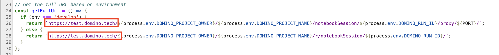

# Developing a Data Cleaning Assistant Web App in Javascript in Domino

Data scientists can publish interactive apps to share their findings with stakeholders. Apps are endlessly flexible and can do things like share results with stakeholders, host interactive analytical dashboards, provide an interface to deployed models, and much more.

We will be creating a Node.js server for uploading, processing, and visualizing CSV files. The server supports dynamic configuration based on the environment (`develop` or `production`).

## Features

### 1. Environment Configuration
- Dynamically sets the server port and proxy prefix based on the environment:
    - `develop`: Port `8887`
    - `Production`: Port `8888`
- Automatically constructs URLs for accessing the application.

### 2. Static File Serving
- Serves `index.html` when accessing the root path or the proxy path.
- Dynamically modifies the `<form>` action in the HTML to handle file uploads with the correct URL prefix.

### 3. CSV File Upload and Processing
- Accepts file uploads at the `/upload` route using the `formidable` library.
- Saves uploaded files to an `uploads` directory, ensuring the directory exists.
- Parses uploaded CSV files using `csv-parser` and processes them into a formatted HTML table with `json2csv`.

### 4. Dynamic HTML Generation
- Generates an HTML page displaying the processed CSV data in a styled table.
- Includes a "Go Back" button to return to the root page.

### 5. 404 Handling
- Responds with a "Not Found" message for unrecognized routes.

#### Dependencies
- **http:** Built-in Node.js module for creating the server.
- **formidable:** For handling file uploads.
- **csv-parser:** For parsing CSV files.
- **json2csv:** For converting JSON data to CSV format.
- **fs and path:** Built-in Node.js modules for file system operations.

## Prerequisites:

- Duplicate the environment that would be used in running the Javascript application.
 

- Update the Dockerfile instructions in the environment definition to install the necessary software and dependencies to execute the file type and script in a workspace.

    ````
    USER root
    RUN apt-get update && \
    apt-get -y install curl build-essential libssl-dev && \
    rm -rf /var/lib/apt/lists/*
    
    # Install Node.js and npm using NodeSource
    RUN curl -fsSL https://deb.nodesource.com/setup_18.x | bash - && \
    apt-get install -y nodejs && \
    rm -rf /var/lib/apt/lists/*
    
    # Verify Node.js and npm installation
    RUN node -v && npm -v
    ````
  
- Scroll to the `Pre-Run Scripts` section and update the below commands to install the required dependencies at runtime.
    ````
    npm install formidable json2csv csv-parser
    ````
  

- Further instructions on how to build a new environment can be found [here](https://docs.dominodatalab.com/en/5.11/user_guide/5dd2c1/edit-environment-definition/).

## Steps to Test the App in a Workspace

-  Launch a workspace using the environment updated above and copy the `Data-Cleaning-Assistant` directory and `app.sh` files to the workspace as seen below. You should also see `node_modules` directory which should include all the dependencies installed through the `pre-run script`.

   
  - Navigate to the `Data-Cleaning-Assistant` directory and edit line 26 and 28. Change <domain> to the domain of your Domino deployment.

      ```
      return `https://<domain>/${process.env.DOMINO_PROJECT_OWNER}/${process.env.DOMINO_PROJECT_NAME}/notebookSession/${process.env.DOMINO_RUN_ID}/proxy/${PORT}/`;
    } else {
      return `https://<domain>/${process.env.DOMINO_PROJECT_OWNER}/${process.env.DOMINO_PROJECT_NAME}/r/notebookSession/${process.env.DOMINO_RUN_ID}/`;
      ```
  

- Open a new terminal and execute the `server.js` script and pass in the `develop` argument since its being tested in the workspace. You should see a similar screenshot below that indicates that Javascript app is running on port 8887.
  
    `node Data-Cleaning-Assistant/server.js develop`

- You should see an output similar to the below which indicates that the App is running on port 8887
  
  ````
  Environment: develop
  Port: 8887
  Using prefix: /integration-test/Data-cleaning-assistant/notebookSession/678915dbd3216d74d9beec1a/proxy/8887
  CSV Data Cleaner Server running on port 8887
  Access the application at https://<DOMAIN>/integration-test/Data-cleaning-assistant/notebookSession/678915dbd3216d74d9beec1a/proxy/8887/
  Current working directory: /mnt
  Raw request URL: /
  Parsed pathname: /
  Serving index.html...
  Attempting to serve file: /mnt/Data-Cleaning-Assistant/index.html
  ````
- Copy the URL returned at `Access the application at` above and paste in a new browser. You should see an output similar to the below.

  
 
- Upload a sample CSV file to test this. You should see a screenshot similar to the below showing that data was successfully cleaned and processed. I uploaded the `data-to-be-scored.csv` file and got the below screenshot.
  


# Steps to run the Javascript through Domino Web App

After you have tested and confirmed that the Javascript app is working as expected, you can go ahead and run the App in your project. Navigate to the App section of your project and click on publish.


- Once the web app is running, click on View App and you should be able to see the same Javascript App as seen below.

